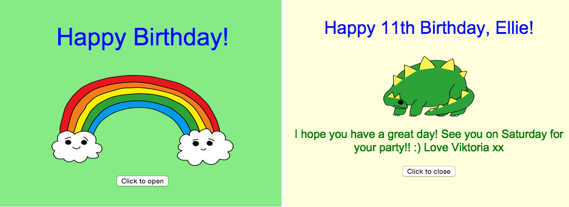
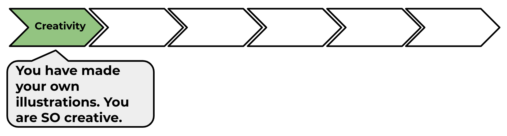

--- challenge ---
## Challenge: create a personalised card
+ Use everything you've learnt about HTML and CSS to finish making a personalised card. And it doesn't have to be a birthday card, it could be one for Christmas or any other occasion!

Here's an example:

You can find more CSS colour names [here](http://jumpto.cc/colours){:target="_blank"}.

+ Once you've finished your card, you can share or email it to someone.

Go to the next project on the HTML & CSS module pathway: 'Tell a story'.

--- /challenge ---

Click on the 'Click me' button to try the next project:

<a href="https://codeclub.org/en/html1">

